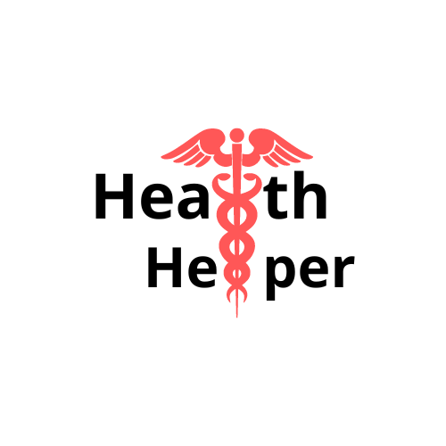

## OEC Programming Competition 

<!-- TABLE OF CONTENTS -->

  
Table of Contents

  <ol>
    <li>
      <a href="#about-the-project">About The Project</a>
      <ul>
        <li><a href="#built-with">Built With</a></li>
      </ul>  
      </ul>
    </li>
    <li>
      <a href="#getting-started">Getting Started</a>
      <ul>
        <li><a href="#installation">Installation</a></li>
      </ul>
    </li>
    <li><a href="#usage">Usage</a></li>
    <li><a href="#contributors">Contributors</a></li>
    <li><a href="#license">License</a></li>
    <li><a href="#contact">Contact</a></li>
    <li><a href="#acknowledgments">Acknowledgments</a></li>
  </ol>

<!-- ABOUT THE PROJECT -->
## About The Project
  
Introducing **Health Helper**, an interactive software you can use to search for and find medical facilities that meet your specific needs.

## Built With  

 

<!-- GETTING STARTED -->
##  Getting Started

### Installation
- Python version 3.11

<!-- USAGE EXAMPLES -->
## Usage

<!-- CONTRIBUTORS -->
## Contributors 
- Matteo Golin: matteo.golin@gmail.com
- Hamnah Qureshi: hamnahq25@gmail.com
- Grant Achuzia: achuziaduby@gmail.com
- Hetarthi Soni: hetarthi.soni@gmail.com
<!-- LICENSE -->
## License

<!-- ACKNOWLEDGMENTS -->
## Acknowledgments